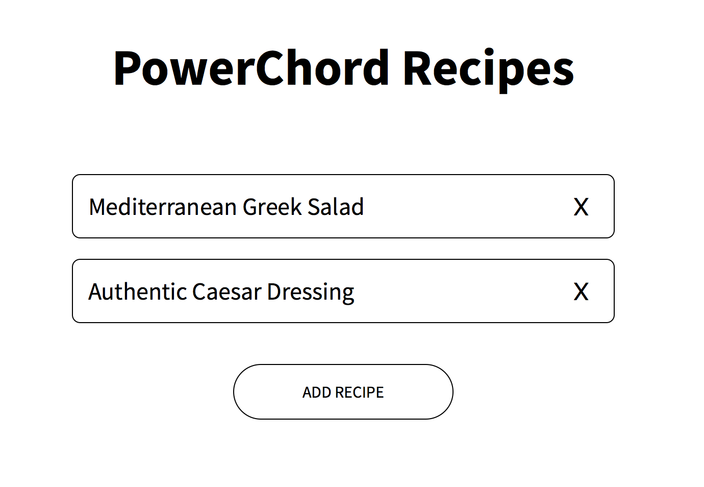

# PowerChord Recipes

This is the PowerChord Recipes App. With this app PowerChord employees, or anyone really, can log their favorite dishes. If you want them to be saved, never close your browser window or shut your computer off. I hope this is not too inconvenient.

To run the app locally, clone this github repo to your local computer. Afterward `cd` into the repo and run `npm install`.

After you have all dependencies installed you can run any number of commands:

- `npm run start` - will run the app in dev on `localhost:8080`
- `npm run start:prod` - will run the app in production on `localhost:3000`
- `npm run test` - will run the tests in test

